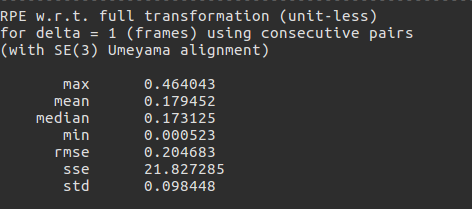
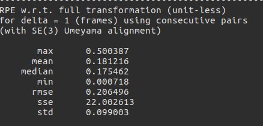

# PL-SLAM with Plücker And Orthogonal representation Line Feature

## Reference
1. PL-SLAM: `https://github.com/rubengooj/pl-slam.git`
2. PL-VIO: `https://github.com/HeYijia/PL-VIO.git`
3. SLAM中线特征的参数化和求导: `https://zhuanlan.zhihu.com/p/65674067`

## Remarks
1. The original PL-SLAM uses Line segment feature with two end point,
here I change it to Plücker Parameterization and use Orthogonal representation for optimize.
2. The closingloop thread should keep closed when run in the mode of Plücker Parameterization and use Orthogonal representation.
3. Change the variable `DEFAULT_USE_LINE_PLUKER` in CMakeLists.txt to choose whether use Plücker And Orthogonal representation or the original one.

## Compare between this two Line representation

The left image is the result of original PL-SLAM, and the right is the result of Plücker And Orthogonal representation, only a small difference between them.